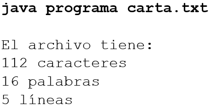

# Instrucciones

Lee cuidadosamente cada problema y elabora los programas como se indican. Para terminar, sube en Eminus elcódigo fuente de cada programa y el enlace GitHub del códgio.

## Problema 1
Escribe un programa que elimina todas las apariciones de una cadena especificada de un archivo de texto. Por ejemplo, invocar

quita la cadena UV del archivo especificado (datos.txt). Su programa debe obtener los argumentos de la línea de comandos.


### Resultado

Archivo original:
``` txt
Este es mi texto para mi tarea de Ingeniería de software
Estudio en la UV Campus Coatzacoalcos
Soy estudiantes de la UV
Viva la Universidad Veracruzana
```

Comando de ejecución:

```bash
java -cp bin problema1.UvMain "src\\problema1\\datos.txt" "UV"
```

Archivo post-ejecución
```txt
Este es mi texto para mi tarea de Ingeniería de software
Estudio en la  Campus Coatzacoalcos
Soy estudiantes de la 
Viva la Universidad Veracruzana
```

## Problema 2
Escriba un programa que cuente el número de caracteres, palabras y líneas en un archivo. Las palabras están separadas por espacios en blanco. El nombre del archivo debe pasarse como un argumento de línea de comandos, como se muestra en el ejemplo:



### Resultado

Archivo:
```txt
Carta de Admiración a la Ingeniería de Software

A la grandiosa Ingeniería de Software,  
Admiro la forma en que transformas ideas en realidad, cómo conviertes líneas de código en soluciones que facilitan la vida de millones.
Eres el puente entre la creatividad y la tecnología, el arte de construir con lógica, precisión y pasión.  
Cada algoritmo, cada arquitectura bien diseñada y cada sistema optimizado son testigos de tu impacto en el mundo.
Gracias por hacer posible lo imposible y por inspirarnos a seguir innovando.  

Con admiración,  
ChatGPT
```

Comando de ejecución
```bash
java -cp bin problema2.Main "src\\problema2\\carta.txt"
```


Salida:
```txt
El archivo tiene:
544 caracteres
87 palabras
10 lineas
```
<br>

<br>

<br>

<br>

<br>

<br>

---

## Getting Started

Welcome to the VS Code Java world. Here is a guideline to help you get started to write Java code in Visual Studio Code.

## Folder Structure

The workspace contains two folders by default, where:

- `src`: the folder to maintain sources
- `lib`: the folder to maintain dependencies

Meanwhile, the compiled output files will be generated in the `bin` folder by default.

> If you want to customize the folder structure, open `.vscode/settings.json` and update the related settings there.

## Dependency Management

The `JAVA PROJECTS` view allows you to manage your dependencies. More details can be found [here](https://github.com/microsoft/vscode-java-dependency#manage-dependencies).
