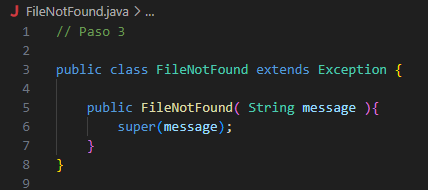
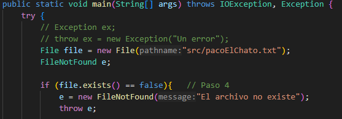

# Práctica – Manejo de Excepciones
Consejos de programación
• Cree nuevas excepciones ampliando la clase Exception, que es la clase base de
todas las excepciones de Java.
• Generar nuevas excepciones mediante la palabra clave throw
• Indica que un método puede generar excepciones mediante la palabra
clave throws
• Controlar excepciones mediante un bloque try { ... } catch (Exception e) {....}
• Obtener acceso al mensaje de error dentro de una excepción mediante el
método getMessage()

## Ejercicios
1. Escriba y ejecute una clase que tenga un método principal que:
a. Lance un objeto de tipo Exception dentro de un bloque try. Asigne a la
excepción un mensaje de error en su constructor
b. En la cláusula catch, imprima el mensaje de la excepción

2. Revise la clase anterior para:
c. Imprima el stack trace  ́para la excepción
d. Agregue una cláusula finally, que imprime un mensaje para indicar que se
ha alcanzado.

3. Cree una nueva clase de excepción mediante la subclase Exception. Asegúrese de
que usted:
a. Asigne a la excepción un nombre adecuado (que describa el error).
b. Proporcione un constructor que acepte un mensaje de error como una
cadena,

4. Escriba y ejecute una clase que contenga un método que produzca la nueva
excepción. Recuerde indicar que el método arroja una excepción. Escriba un
método principal que:
a. Crea una instancia del objeto,
b. Invoca el método que genera la excepción,
c. Controla la excepción iniciada imprimiendo el mensaje de error en la
consola

5. Cree una clase similar a la anterior (simplemente guarde el archivo con un
nombre diferente y cambie el nombre de la clase para que coincida). Cámbielo
para que
a. No crea una instancia del objeto. En su lugar, asigne el valor null a la
variable.
b. Atrapa la excepción (en lugar de su subclase específica)
c. Identificar lo que sucede cuando se ejecuta el programa

6. Escribir y ejecutar una clase que contenga dos métodos, a y b.
a. Implemente el método a para que produzca una excepción propia
b. Implemente el método b para que llame a a, detecte su excepción y lance
una de las suyas
e. Agregue un método principal que invoque b e imprima el método stack
trace

